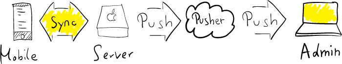

Daylite Touch Notify
====================

What is it?
-----------

Monitor Daylite Touch syncs on your Mac.
This is useful for admins, who want to be sure that the Daylite Server is working correctly.

The tool consists of two parts, a server and a client script.

### Server

This part runs on the machine with your Daylite Server installed.
The software uses [watchdog](https://pypi.python.org/pypi/watchdog) to detect changes in the Daylite Touch logfile.
Whenever a user syncs with Daylite, this file gets modified and a message is broadcasted to all clients (using [pusher](http://www.pusher.com)).

### Client

On the client machine, another script receives the pusher message and displays an OSX notification popup for each synchronization.
You can write new clients with ease. Any platform and language is supported. Just subscribe to the pusher channel and you will receive updates automatically. I'll happily accept pull requests.

Howto
-----

1. Register at [pusher.com](http://www.pusher.com)
2. Insert your pusher key into `dtouchclient.py`.
3. Insert your pusher app-id, key and secret into `dtouchserver.py`.
4. Start `dtouchserver.py` on your server.
5. Start `dtouchclient.py` on your client.

Running the script in the background
------------------------------------

If you want to have the script running as a daemon process, which starts automatically, you can use `launchctl` and a plist file on Mac OS X. Here is how.

### On the server

    ./setup_server.sh

### On the client

    ./setup_client.sh

This will place the scripts in `/usr/bin` and immediately run the program.

If you ever want to remove the script, you can use the unload command of `launchctl`, e.g.:

    launchctl unload ~/Library/LaunchAgents/de.matthias-endler.dtouchclient.plist

(Instructions adapted from [mnem on StackOverflow](http://stackoverflow.com/a/9523030/270334))

Troubleshooting
---------------

If you can't get it to work, look into the `dtouchserver` logfile first.

    tail ~/Library/Logs/dtouchserver.log

You should see messages like `20XX-XX-XX XX:XX:XX,XXX Sync from user (OUT:9/IN:9)`.
If not, something's wrong with the server. Try to run the script directly with
`python dtouchserver.py`.

If everything looks fine until here, check your credentials (API key,...) again.
After that, run the client locally with `python dtouchclient.py`. If you can get
messages but nothing happens when you run the setup script, you can add a logger
to your plist file (follow the instructions in `de.matthias-endler.dtouchclient.plist`)

If the logfile tells you about import errors, replace

    #!/usr/bin/env python

inside `dtouchclient.py` with the output of `which python` and run
`./setup_client` again.

